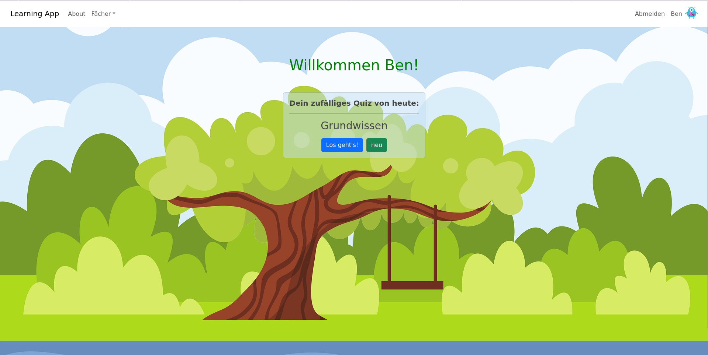
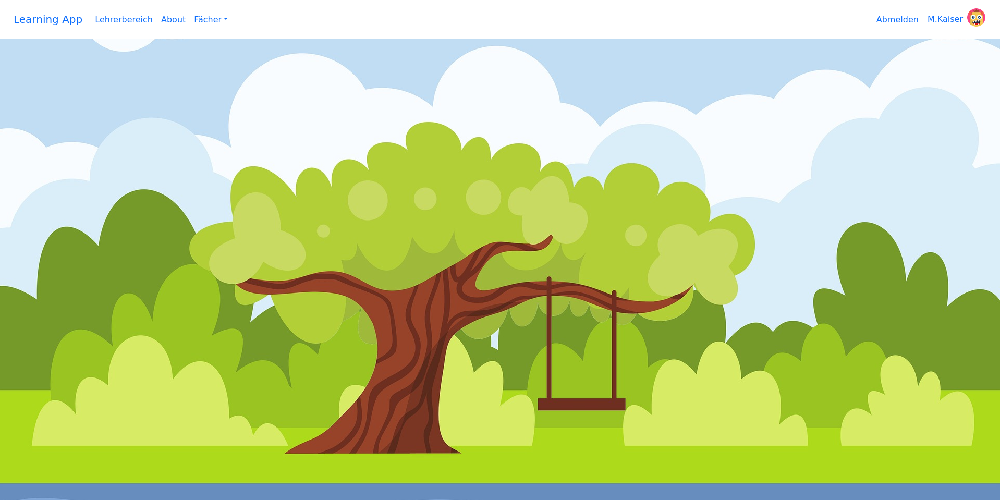

# Learning App - Django Project

## About

With this project, I wanted to create an app that would allow a school to offer exercises for its students. Teachers have the opportunity to create small quizzes for their classes. The categories and questions/answers can be customized and deleted/updated. At the end of a quiz, a score is calculated and saved. This is set by the teacher themselves. In this way, teachers can measure and compare the progress of their students.

__Student View with random quiz on homepage:__

 

__Teacher View with "Lehrerbereich" (Admin site with staff role):__



## Future ideas

&#9744; introduce a student chat that is monitored by the teachers

&#9744; for students: overview of all subjects with completed quizzes and ranking

&#9744; for teachers: overview of all classes you teach with forwarding to the class and forwarding to individual students

## Setup

1. Clone this repo.
1. Setup a venv and install django:

``` bash
python3 -m venv .venv
source/.venv/bin/activate
pip install --upgrade pip wheel setuptools
pip install django
```

Apply default migrations from Django:

```bash
python manage.py migrate
```

Install requirements (in your venv):

```bash
pip install -r requirements.txt
```
