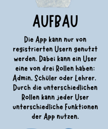

# Learning App - Django Project

## Idee und Aufbau

    

## Nutzer: Schüler und Lehrer

  

## Adminseite/Lehrerbereich


__Student View with random quiz on homepage:__


__Teacher View with "Lehrerbereich" (Admin site with staff role):__


## Try it out yourself

__If you want to take a closer look at the app head to__: https://learningapp.winderling.net/ and log in as a student or a teacher.

__Student login__: Benutzername: test-schüler, Passwort: ichbineintestschüler1234

__Teacher login__: Benutzername: test-lehrer, Passwort: ichbineintestlehrer1234

Diese beiden Test-Accounts sind nötig, da ich als Admin nach einer neuen Registrierung dem User erstmal die nötigen Rechte vergeben müsste. 

## Future ideas

&#9744; introduce a student chat that is monitored by the teachers

&#9744; for students: overview of all subjects with completed quizzes and ranking

&#9744; for teachers: overview of all classes you teach with forwarding to the class and forwarding to individual students

## Setup

Clone this repo

```bash
git clone git@github.com:ShahiW/LearningApp.git
cd LearningApp
```

Setup a venv and install requirements:

``` bash
python3 -m venv .venv
source/.venv/bin/activate
pip install --upgrade pip wheel setuptools
pip install -r requirements.txt
```

Apply all migrations from Django:

```bash
python manage.py migrate
```

Install Bootstrap into your static folder:

```bash
cd LearningApp/LearningApp/static
npm install bootstrap
cd -
```

Start App:

```bash
python manage.py runserver
```
