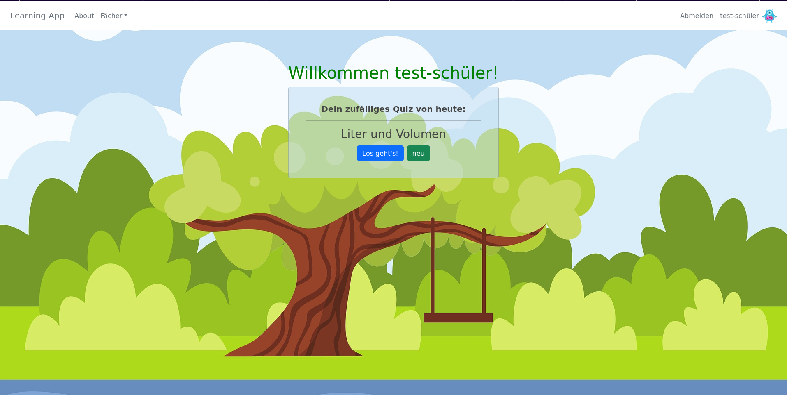
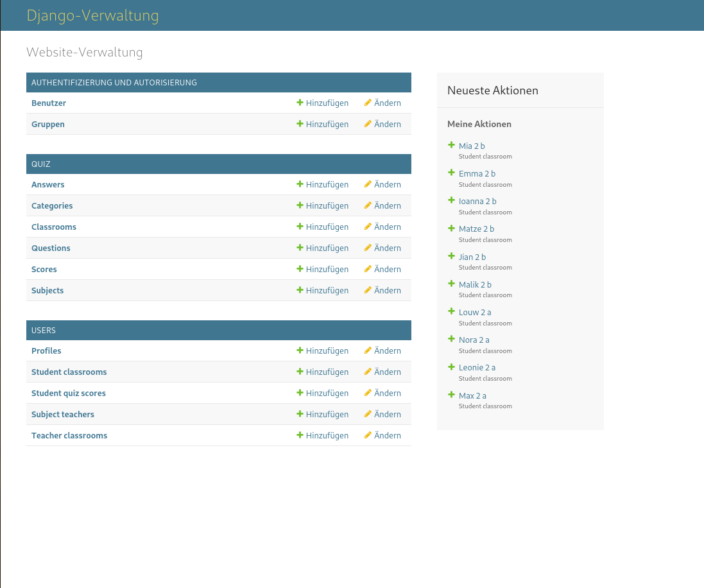

# Learning App - Django Projekt

## Idee und Aufbau

Für mein erstes Django Projekt habe ich mich von der Schüler-App "Learning View", die meine Tochter in der Grundschule nutzt, inspirieren lassen. Mit meiner App __Learning App__ wollte ich folgende Themne umsetzen:

* __Authentifizierung__: Login und Nutzung der App nur als registrierte:r/angemeldete:r Nutzer:in

* __Authorisierung__: Rollenverteilung &rarr; Lehrer:in, Schüler:in, Admin.

  * Rechte __Adminrolle__: View, write, change, delete &rarr; __all entities__
  * Rechte __Lehrerrolle__: View, write, change, delete &rarr; __eingeschränkt__
  * Rechte __Schülerroller__: __kein Zugriff__ auf Adminseite/Lehrerbereich

* __Passwort zurücksetzen__ lassen: Verbindung zu Mail Server

* __Eigener Avatar__: eigene Bilder hochladen

* __Personalisierte Anischt__: basierend auf Nutzerrechten sehen Schüler:innen andere Inhalte auf ihrer Landing Page als Lehrer:innen.

## Nutzer:innen

### Schüler:innen

Die Schüler:innen sehen in ihrem Bereich nur die Fächer, die sie lernen, basierend auf ihrer Klassenstufe. Sie haben die Möglichkeit ein zufälliges Quiz auf ihrer User-Page zu machen. Ansonsten stehen ihnen die verschiedenen Quizze nach Fach &rarr;  Kategorie zur Verfügung.



### Lehrer:innen

Als Lehrer:in hat man Zugriff auf die Adminseite. Hier können die Lehrkräfte ihre eigenen Quizze erstellen, anpassen und löschen. Außerdem können sie die Liste mit ihren Schüler:innen sehen, diese jedoch nicht anpassen.


## Adminseite/Lehrerbereich



## Einfach ausprobieren

__Hier &rarr;__ https://learningapp.winderling.net/

Da man vom Admin nach Registrierung als Nutzer hinzugefügt und eine Rolle zugewisen werden muss, habe ich zwei Test-User angelegt: 

* __Schülerrolle__:
  * Benutzername: test-schüler
  * Passwort: ichbineintestschüler1234

* __Lehrerrolle__:
  * Benutzername: test-lehrer
  * Passwort: ichbineintestlehrer1234

## Ergänzungen für die Zukunft

&#9744; Chatraum für die Schülerinnen und Schüler einer Klasse

&#9744; Schüler:innen &rarr; Übersicht aller Fächer mit abgeschlossenen und noch zu erledigenden Quizzes, inkl. Score/Ranking

&#9744; Lehrer:innen &rarr; Übersicht aller Klassen, die von der jeweiligen Lehrkraft unterrichtet werden mit der Möglichkeit zu jedem einzelnen Schüler/jeder einzelnen Schülerin zu navigieren und deren Score/Ranking zu sehen

## Setup

Klone dieses Repo:

```bash
git clone git@github.com:ShahiW/LearningApp.git
cd LearningApp
```

Setze venv auf und installiere Requirements:

``` bash
python3 -m venv .venv
source/.venv/bin/activate
pip install --upgrade pip wheel setuptools
pip install -r requirements.txt
```

Alle migrations von Django übernehmen:

```bash
python manage.py migrate
```

Installiere Bootstrap in deinen static Ordner:

```bash
cd LearningApp/LearningApp/static
npm install bootstrap
cd -
```

Starte die App:

```bash
python manage.py runserver
```
